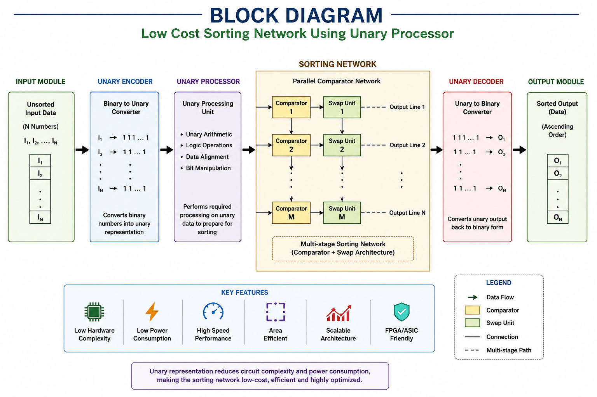
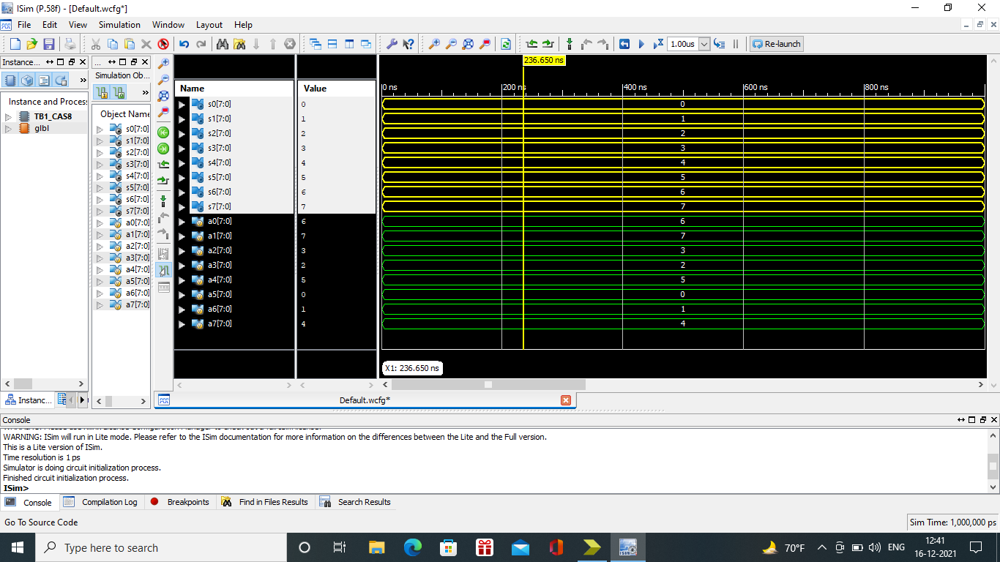
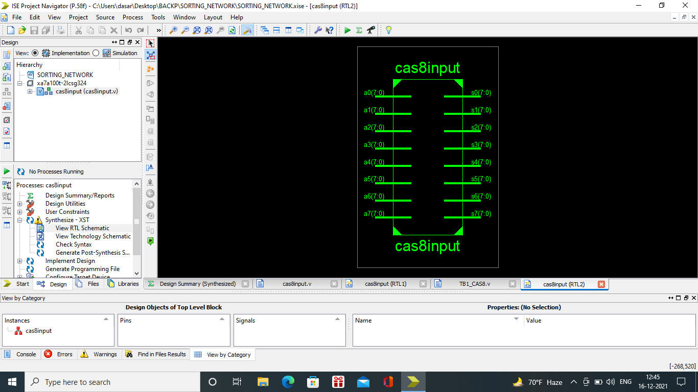
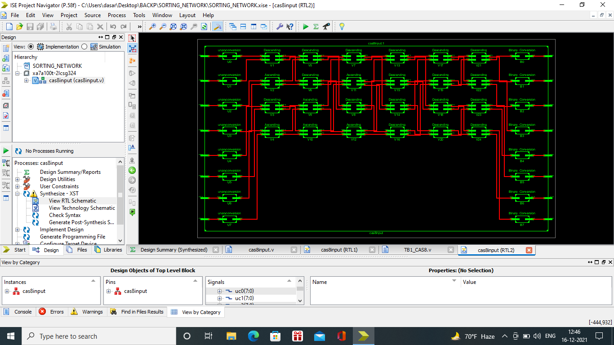

# 🚀 Low-Cost Sorting Network Using Unary Processor

<p align="center">
  <b>A Hardware-Efficient Sorting Architecture Using Unary Processing for Low-Area, Low-Power, and High-Speed Data Sorting.</b>
</p>

---

# 📌 Project Overview

The **Low-Cost Sorting Network Using Unary Processor** project presents a hardware-efficient sorting architecture designed to perform high-speed sorting while minimizing hardware complexity, power consumption, and implementation cost.

Unlike traditional sorting networks that require numerous comparators and arithmetic units, this project utilizes **Unary Processing** to simplify computations, reduce logic utilization, and optimize hardware resources.

The architecture converts binary input data into unary representation, processes it using a unary processor, performs sorting through an optimized parallel sorting network, and converts the sorted unary data back to binary format.

This design is well suited for **FPGA**, **ASIC**, and **VLSI** implementations where area, speed, and power efficiency are critical.

---

# 🏗️ Block Diagram / Architecture

<p align="center">
  
</p>

## Architecture Flow

```text
          Input Data
               │
               ▼
        Unary Encoder
               │
               ▼
     Unary Processing Unit
               │
               ▼
     Parallel Sorting Network
               │
               ▼
        Unary Decoder
               │
               ▼
         Sorted Output
```

---

# ✨ Features

- 🚀 Hardware-Efficient Sorting Architecture
- ⚡ Unary Processor-Based Design
- 🔋 Low Power Consumption
- 📉 Reduced Hardware Area
- ⚙️ Parallel Data Processing
- 🔄 High-Speed Sorting
- 💻 FPGA Compatible
- 🧩 ASIC Ready
- 📈 Scalable Architecture
- 🛠️ Modular RTL Design

---

# 🛠️ Technologies Used

| Category | Technology |
|----------|------------|
| Hardware Description Language | Verilog HDL |
| Design Methodology | RTL Design |
| Digital Logic | Combinational & Sequential Logic |
| Hardware Platform | FPGA |
| Semiconductor Design | ASIC |
| Design Domain | VLSI |
| Processing Technique | Unary Computing |
| Architecture | Sorting Network |

---

# 🚀 Installation

Clone the repository

```bash
git clone https://github.com/your-username/Low-Cost-Sorting-Network-Using-Unary-Processor.git
```

Navigate to the project

```bash
cd Low-Cost-Sorting-Network-Using-Unary-Processor
```

Open the project in your preferred HDL tool such as:

- Xilinx Vivado
- Intel Quartus Prime
- ModelSim
- QuestaSim

---

# ▶️ How to Run

### Step 1

Open the project in your HDL simulator.

### Step 2

Compile all RTL source files.

### Step 3

Compile the testbench.

### Step 4

Run the simulation.

### Step 5

Observe:

- Input Data
- Unary Encoding
- Unary Processing
- Comparator Operations
- Sorting Network
- Unary Decoding
- Sorted Output

---

# 📊 Results

The proposed architecture demonstrates:

- ✅ Reduced Hardware Complexity
- ✅ Lower Area Utilization
- ✅ Reduced Power Consumption
- ✅ High-Speed Parallel Sorting
- ✅ Efficient Unary Processing
- ✅ FPGA Implementation Ready
- ✅ ASIC Friendly Design
- ✅ Improved Hardware Resource Utilization

---

# 📸 Screenshots

## 🏗️ Block Diagram

<p align="center">

</p>

---


## 📊 Simulation Output

<p align="center">

</p>

---
## Synthesis output-1

<p align="center">

</p>

---
## Synthesis output-2

<p align="center">

</p>

---
# 🎯 Applications

- FPGA-Based Embedded Systems
- ASIC Design
- VLSI Systems
- Digital Signal Processing
- Image Processing
- High-Speed Data Processing
- Communication Systems
- Real-Time Computing
- Hardware Accelerators
- Edge Computing

---

# 📚 Learning Outcomes

Through this project, I gained practical experience in:

- RTL Design
- Verilog HDL Programming
- Digital Logic Design
- Sorting Network Architecture
- Unary Computing
- FPGA Design Flow
- VLSI Design Methodology
- Hardware Optimization
- Parallel Processing
- Computer Architecture

---

# 🔮 Future Enhancements

- FPGA Hardware Implementation
- ASIC Physical Design
- Power Optimization
- Area Optimization
- Performance Benchmarking
- Multi-Core Unary Processor
- AI Hardware Accelerator Integration
- High-Speed Real-Time Sorting Systems

---

# 🤝 Contributing

Contributions, suggestions, and improvements are welcome.

If you have ideas to improve this project, feel free to:

- Fork the repository
- Create a new feature branch
- Commit your changes
- Submit a Pull Request

---

# 📜 License

This project is licensed under the **MIT License**.

Feel free to use, modify, and distribute this project for academic and research purposes.

---

# ⭐ Support

If you found this project helpful, please consider giving this repository a **Star ⭐**.

Your support encourages continuous learning and the development of more open-source VLSI and Hardware Design projects.

---

## 👨‍💻 Author

**Manda Sankeerth**

Electronics and Communication Engineering (ECE)

Interested in:

- VLSI Design
- Physical Design
- FPGA Development
- ASIC Design
- Machine Learning
- Embedded Systems

---

## 📬 Connect With Me

- GitHub: [https://github.com/your-username](https://github.com/SANKEERTH2006-TECH)
- LinkedIn: [https://linkedin.com/in/your-linkedin-profile](https://www.linkedin.com/in/mandasankeerth6309753161/)

---

<h3 align="center">⭐ If you like this project, don't forget to give it a Star! ⭐</h3>
